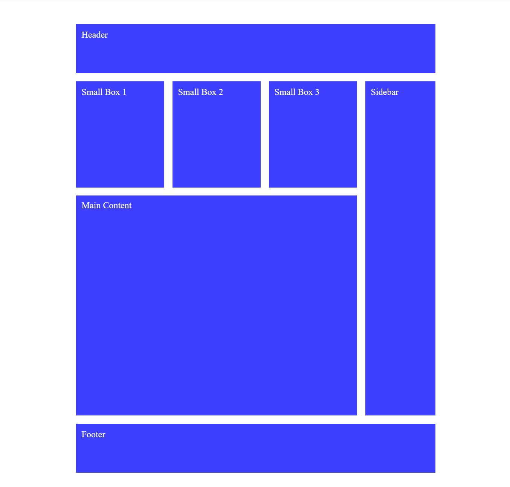

# Grid CSS Layout

This project is an example that allows you to create a grid layout using HTML and CSS. The project shows a grid layout with various content boxes.

## Features

- One page design with grid layout.
- Different grid elements and contents.
- Colorful background and basic style settings.

## Technologies

- HTML
- CSS

# Grid CSS Layout

Bu proje, HTML ve CSS kullanarak bir grid düzeni oluşturmanızı sağlayan bir örnektir. Proje, çeşitli içerik kutuları ile bir grid düzeni gösterir.

## Özellikler

- Grid düzeni ile bir sayfa tasarımı.
- Farklı grid elemanları ve içerikleri.
- Renkli arka plan ve temel stil ayarları.

## Teknolojiler

- HTML
- CSS

[Canlı Demo'yu Deneyin](https://fatihycan.github.io/Grid-Css/)
